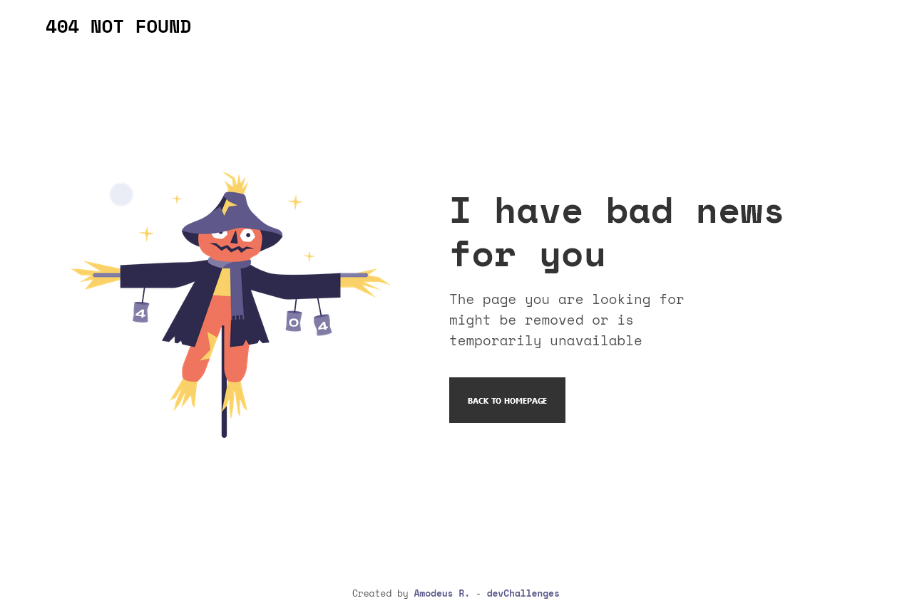
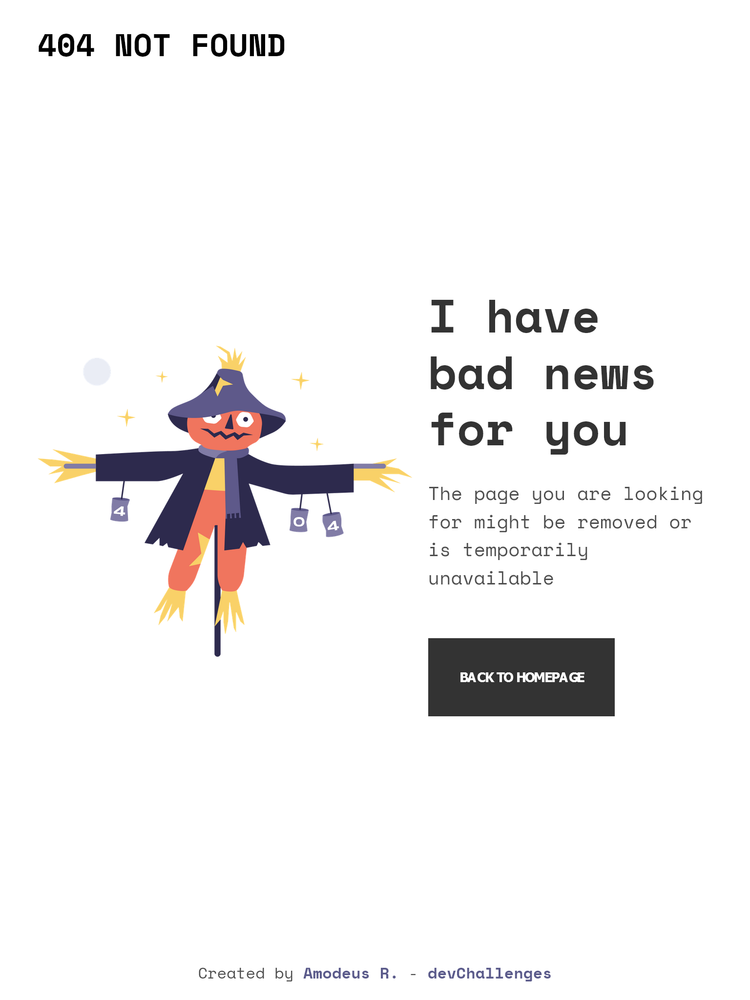
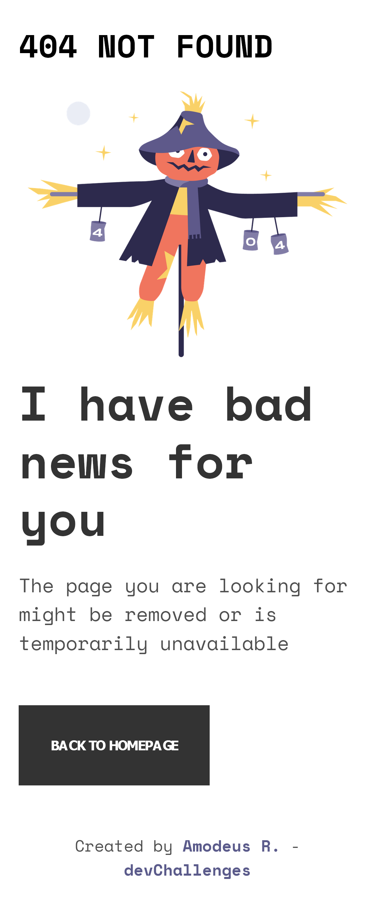

<!-- markdownlint-disable MD033 -->
<h1 align="center">DevChallenges - 404 Not Found</h1>

This is a solution to the <a href="https://devchallenges.io/challenges/wBunSb7FPrIepJZAg0sY">404 Not Found challenge on DevChallenges</a>

<!-- markdownlint-enable MD033 -->

## Table of contents

- [Overview](#overview)
  - [The challenge](#the-challenge)
  - [Screenshots](#screenshots)
  - [Links](#links)
- [My process](#my-process)
  - [Built with](#built-with)
- [Author](#author)

## Overview

### The challenge

- Responsive 404 not found page

### Screenshots

| Desktop View (1280px) | Tablet View (768px) | Mobile View (375px)|
|-------|-------|-------|
||||

### Links

- Live Site URL: [Github Pages](https://amodeusr.github.io/DCH--404-not-found)

## My process

### Built with

- Semantic HTML5 markup
- BEM
- Flexbox

## Author

- Website - [amodeusr.pages.dev](https://amodeusr.pages.dev)
- Github - [@AmodeusR](https://github.com/amodeusr)
- Linkedin - [@AmodeusR](https://www.linkedin.com/in/AmodeusR)
- Frontend Mentor - [@AmodeusR](https://www.frontendmentor.io/profile/AmodeusR)
